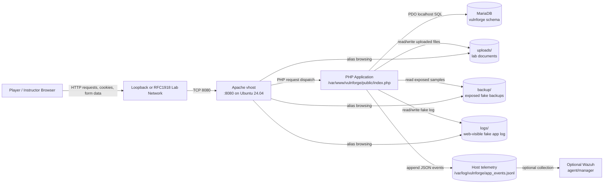
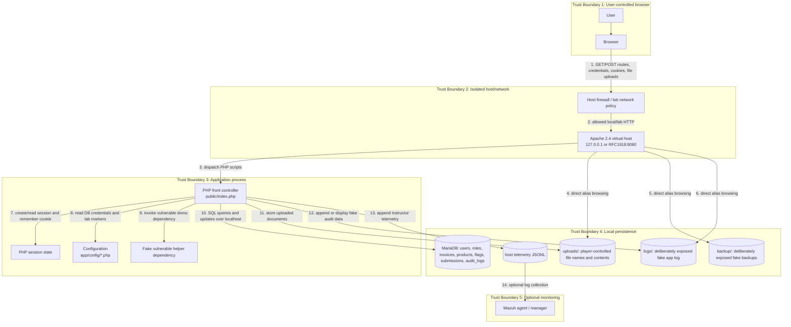

# Threat Model: VulnForge-LAMP on Ubuntu Server 24.04 LTS

> **Lab-only warning:** VulnForge-LAMP is intentionally vulnerable. This threat model assumes a single Ubuntu Server 24.04 LTS host running the Northstar Outfitters training portal in an isolated lab network. Do not expose this application to the internet.

## 1. Scope and assumptions

### In scope

- Ubuntu Server 24.04 LTS host operating as a LAMP stack.
- Apache HTTP Server virtual host on TCP `8080`.
- PHP application code under `/var/www/vulnforge`.
- MariaDB database and the `vulnforge` schema.
- Local filesystem artifacts in `uploads/`, `backup/`, and `logs/`.
- Browser sessions, cookies, login flows, profile import, invoice API, catalog search, uploads, diagnostics, audit viewer, and scoreboard.
- Optional Wazuh log collection if separately deployed.

### Out of scope

- Real payment processors, email delivery, identity providers, cloud APIs, or third-party analytics; the app is designed to avoid external service dependencies.
- Internet-facing production deployment. Public exposure is explicitly outside the safety boundary.
- Security of real user data. All seeded business records, secrets, flags, and users are fictional lab data.

### Deployment assumptions

- Ubuntu Server 24.04 LTS is patched from official repositories.
- The installer runs as `root` and installs Apache, MariaDB, PHP, and required PHP extensions.
- The default bind address is `127.0.0.1:8080`; any non-loopback deployment is limited to RFC1918 lab networks.
- Apache serves `public/` as the document root and exposes selected lab artifact aliases.
- MariaDB listens locally and is accessed by the PHP app with a dedicated local database account.
- Instructors may optionally collect host telemetry from `/var/log/vulnforge/app_events.jsonl`.

## 2. Security objectives

Because this is a deliberately vulnerable training application, the primary objective is **containment**, not vulnerability elimination.

1. Prevent lab vulnerabilities from becoming an internet-accessible attack surface.
2. Keep all data fictional, resettable, and isolated from personal or enterprise data.
3. Preserve challenge behavior for OWASP training while documenting the risks clearly.
4. Maintain enough host and application telemetry for instructor-led detection exercises.
5. Make reset and rebuild paths reliable after compromise during exercises.

## 3. High-level architecture

## 4. Data flow diagram

### Data flow notes

| ID | Flow | Data | Main risks |
|---:|---|---|---|
| 1 | Browser to Apache | Credentials, cookies, route parameters, JSON profile imports, file uploads, flag submissions | Credential stuffing against fake accounts, SQL injection payloads, IDOR attempts, XSS probes, malicious filenames |
| 2 | Network policy to Apache | HTTP on port 8080 | Accidental public exposure, lateral access from a broader network than intended |
| 3 | Apache to PHP | Request metadata and body | Route confusion, unsafe default PHP settings, verbose errors |
| 4-6 | Apache aliases to artifacts | Uploads, fake backups, fake logs | Information disclosure by design; risk increases if real data is copied into lab directories |
| 7 | PHP session/cookie handling | Session ID and reversible remember token | Session fixation, token tampering, cookie theft on plain HTTP |
| 8 | PHP config reads | DB credentials, debug settings, lab markers | Secret disclosure if filesystem permissions or backup exposure are expanded |
| 9 | PHP dependency demo | User-facing dependency output | Vulnerable component behavior and supply-chain lessons |
| 10 | PHP to MariaDB | Users, invoices, products, support tickets, flags, audit records | SQL injection, weak password hashes, broken object authorization, data tampering |
| 11 | PHP to uploads | Player-supplied files | Stored content abuse, disk exhaustion, unsafe file names; PHP execution is disabled for this alias |
| 12 | PHP to fake app logs | Web-visible fake activity log | Log injection, incomplete audit coverage, accidental sensitive data logging |
| 13-14 | Host telemetry to Wazuh | JSONL security events | Monitoring gaps, overcollection, permissions errors, false positives |

## 5. Assets and sensitivity

| Asset | Sensitivity | Owner | Notes |
|---|---|---|---|
| Lab VM and OS account access | High | Instructor / lab operator | A compromised host can affect other lab systems if network isolation fails. |
| MariaDB schema | Medium | Lab app | Contains fictional accounts, invoices, flags, submissions, and audit records. |
| App source and configuration | Medium | Lab app | Runtime config includes database credentials. |
| Browser sessions and cookies | Medium | Player | Lab-only identity context; should not be reused elsewhere. |
| Uploaded files | Medium | Player / instructor | Must contain only fake data. |
| Exposed backups and logs | Low to Medium | Lab app | Intentionally exposed challenge artifacts; dangerous if real data is placed there. |
| Instructor walkthroughs and flags | Medium | Instructor | Should not be published to player-facing repos. |
| Optional telemetry | Medium | Instructor / SOC trainer | Useful for exercises but can disclose player activity. |

## 6. Threat actors

| Actor | Capability | Motivation |
|---|---|---|
| Authorized player | Browser access to the lab app and published credentials | Complete OWASP training challenges. |
| Curious lab peer | Access from same isolated network if RFC1918 bind is enabled | View or alter another player's lab progress. |
| Instructor / operator | Host shell and database access | Administer, reset, observe, and teach. |
| Malware or internet attacker | Should have no route to the service | Would exploit intentionally vulnerable code if isolation fails. |
| Accidental insider | Copies real secrets or data into lab directories | Convenience or mistake, causing data leakage through designed exposures. |

## 7. STRIDE threat analysis

| STRIDE | Threat | Affected components | Existing control | Recommended containment or mitigation |
|---|---|---|---|---|
| Spoofing | Default fake credentials allow anyone with lab access to authenticate. | Login, sessions | Lab-only warning; localhost default bind | Keep host isolated; rotate or randomize accounts for shared labs if challenge design allows. |
| Spoofing | Reversible remember cookie can be forged or tampered with. | Browser cookies, session restore | Cookie is lab-only and resettable | Use signed, `HttpOnly`, `SameSite`, short-lived cookies in any hardened derivative. |
| Tampering | SQL injection can alter or extract catalog/database content. | Products route, MariaDB | Fictional seed data only | Use prepared statements in hardened mode; snapshot and reset after exercises. |
| Tampering | Unsigned profile import can modify effective role. | Profile import, admin console | Intended challenge | Require signed imports or server-side role validation outside the lab. |
| Repudiation | Web-visible audit viewer is intentionally incomplete. | `audit_logs`, logs route | Separate host telemetry exists | Rely on host telemetry/Wazuh for detection labs; do not treat in-app logs as authoritative. |
| Information disclosure | Backup, upload, and log aliases are browsable. | Apache aliases, filesystem | Fake artifacts; local/RFC1918 access only | Never put real data there; disable indexes and aliases in hardened deployment. |
| Information disclosure | Verbose debug output reveals paths, markers, and environment details. | Diagnostics, API errors, product errors | Training-only debug mode | Disable debug and genericize errors for any non-lab deployment. |
| Denial of service | Uploads can consume disk space or create many files. | Upload directory, Apache/PHP | Isolated VM and reset script | Enforce upload size/count limits and monitor disk usage in multi-user labs. |
| Denial of service | Expensive or malformed SQL inputs can degrade MariaDB. | Catalog search, APIs | Local DB only | Add query limits, input validation, and DB resource controls. |
| Elevation of privilege | Broken access control permits admin route access or invoice IDOR. | Admin, invoice API | Intended OWASP A01 challenges | Enforce server-side authorization on every object and privileged route in hardened derivatives. |
| Elevation of privilege | Weak filesystem permissions for resettable logs/uploads enable broad local writes. | `uploads/`, `logs/` | Bounded fake directories only | Restrict write permissions and segregate web user access for production-like builds. |
| Supply chain | Fake vulnerable helper demonstrates dependency risk. | Vendor helper route | Bundled local dependency | Pin, scan, and update dependencies in real apps; remove demo helper outside training. |

## 8. Ubuntu Server 24.04 host considerations

- Apply security updates before each lab cohort and after restoring stale VM snapshots.
- Use a host firewall such as `ufw` to allow TCP `8080` only from loopback or the intended private lab subnet.
- Keep SSH restricted to instructors, preferably by key, and do not share OS credentials with players.
- Run the VM on a private or internal virtual switch rather than a bridged/public network.
- Do not install unrelated services or store unrelated files on the same VM.
- Use VM checkpoints before exercises and restore or run the reset script between cohorts.
- If Wazuh is enabled, verify that collection scope is limited to lab logs and that students know activity may be monitored.

## 9. Abuse cases and expected detections

| Abuse case | Likely signal | Detection source |
|---|---|---|
| SQL injection search probes | Suspicious `q` parameters, database exceptions, unusual product result counts | Host telemetry, Apache access log, app events |
| Invoice IDOR enumeration | Repeated `api-invoice` requests for sequential IDs | Host telemetry and Apache access log |
| Admin bypass attempts | Access to `route=admin` with `admin=1` or imported admin role | Host telemetry, in-app behavior |
| Upload abuse | Large files, unexpected extensions, many writes to `uploads/` | Apache access log, filesystem monitoring, Wazuh file checks |
| Backup/log scraping | Directory index requests under `/backup/`, `/logs/`, `/uploads/` | Apache access log |
| Verbose error harvesting | Requests with invalid product IDs or missing API arguments | Host telemetry, Apache access log |
| Reset token guessing | Repeated posts to password reset route | Host telemetry and Apache access log |

## 10. Risk register

| ID | Risk | Likelihood | Impact | Rating | Treatment |
|---|---|---:|---:|---:|---|
| R1 | Application is accidentally exposed beyond the lab network. | Medium | High | High | Enforce localhost/RFC1918 binding, firewall rules, no port forwarding, periodic network scans. |
| R2 | Real data is uploaded or copied into exposed artifact directories. | Medium | High | High | Student/instructor briefing, banners, reset procedures, directory review before sharing images. |
| R3 | A player compromises another player's session or progress on a shared lab host. | Medium | Medium | Medium | Prefer per-player VMs; randomize credentials; reset between users. |
| R4 | Disk exhaustion through uploads or logs. | Medium | Medium | Medium | VM quotas, upload limits, monitoring, reset. |
| R5 | Instructor-only walkthroughs or flags are published to players. | Medium | Medium | Medium | Keep repo private or split instructor docs into a private branch. |
| R6 | Optional monitoring collects more data than intended. | Low | Medium | Low-Medium | Review Wazuh rules and retention before use. |
| R7 | Stale Ubuntu packages increase host compromise risk. | Medium | High | High | Patch snapshots and rebuild from clean images. |

## 11. Hardening roadmap for a non-training derivative

If VulnForge code is ever adapted into a non-vulnerable demo or production-like app, remove the intentional defects first:

1. Disable public aliases for `backup/`, `logs/`, and unrestricted `uploads/`.
2. Turn off debug output and replace verbose exceptions with generic error pages.
3. Use prepared statements for every SQL query.
4. Replace MD5 password hashes with `password_hash()` / `password_verify()` using a current algorithm.
5. Enforce authorization checks on every route and every object lookup.
6. Sign or reject imported profile data that can affect authorization.
7. Use secure session cookie attributes and signed remember-me tokens.
8. Add CSRF protection to state-changing forms.
9. Validate uploads by size, extension, content type, and storage location.
10. Restrict filesystem permissions to least privilege.
11. Implement complete audit logging with protected retention.
12. Add dependency scanning, patch management, and configuration baseline checks.

## 12. Open questions

- Will each student receive a dedicated VM, or will multiple students share one host?
- Is the RFC1918 bind option required, or can all access remain through loopback/SSH tunneling?
- Should Wazuh be mandatory for the class, or remain an optional detection lab?
- How often will VM snapshots be refreshed with Ubuntu security updates?
